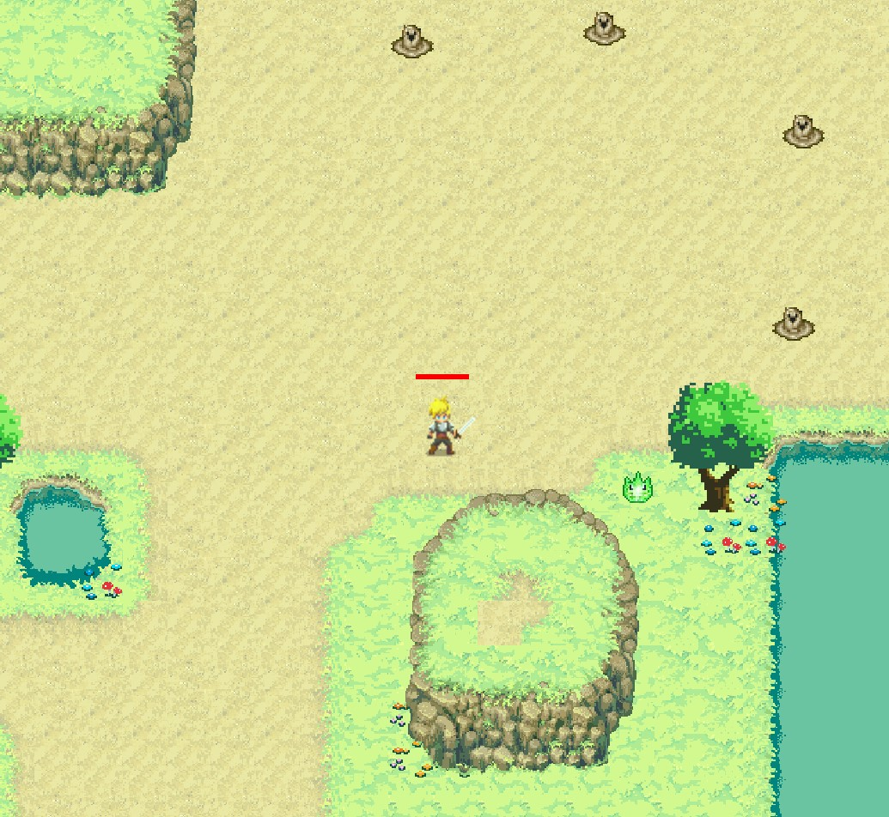
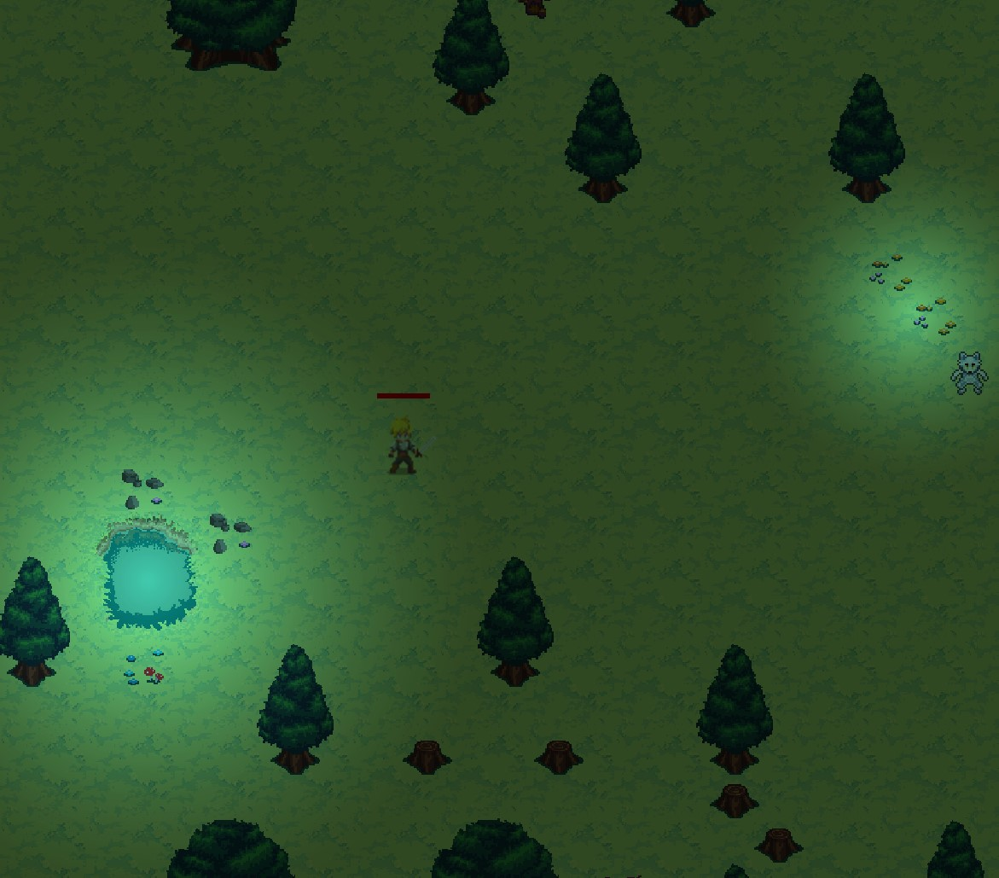
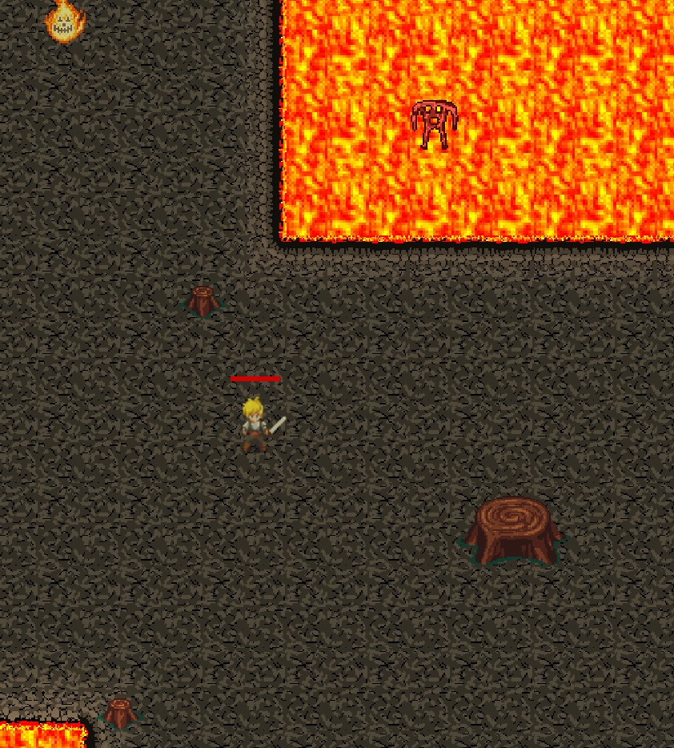

# Zenith Warrior
Authors: *Lami Beach, Michael Refvem, Andrew Smith*

This is a Unity game with a 2D, top-down, RPG environment. 
The object of this game is to navigate your player through an unforgiving landscape that is smothered with ruthless enemies. 
Once all enemies are defeated, a 'final boss' will appear that is even more lethal than all other enemies and must be defeated. 
Only then can the game be completed. 

---

### Story of Zenith Warrior
Zenith Warrior is a story about a man on a mission to slay enemies and a final boss. No one knows quite yet 
what made our fearless warrior embark on this journey. Enemies appeared in his land, and now he has no choice 
but to mess stuff up.

---

### How to Play

Download Zip File
- [Windows](https://github.com/2D-Devs/Zenith-Warrior/raw/development/Downloads/Windows_x86/Zenith-Warrior.zip)
- [Linux]()

**Windows Users:**
1. Decompress the zip file
2. Navigate to folder with your corresponding OS (Mac, Windows, Linux)
3. Run `Zenith-Warrior.exe`

**Linux Users**

---

### Controls

| Movements | PC | Xbox Controller |
| - | - | - |
| Move left | A | L-joystick Left |
| Move Right | D | L-joystick Right |
| Move Up | W | L-joystick Up |
| Move Down | S | L-joystick Down |
| Sprint | Left Shift | |
| Attack | Left Ctrl | A |

---

### Gameplay Visuals

---

### Requirements

[Requirements](Requirements.md)

---

### User Stories

[User Stories](UserStories.md)

---

### Wireframes

[Wireframes](Wireframes.md)

---

### Tools Used

- Visual Studio Community 2019
- C#
- Unity
- Unity 2D-extras
- Unity Hub
- Unity Collaboration

---

### Data Model

---
### Model Properties and Requirements

#### Zenith Warrior - Character

| Parameter | Type | Required |
| --- | --- | --- |
| ID  | int | YES |
| UserName | str | YES |
|CurrentLocation| Nav|YES|

#### Zenith Warrior - Enemy

| Parameter | Type | Required |
| --- | --- | --- |
| ID  | int | YES |
|Location| Nav|YES|

#### Zenith Warrior - Location

| Parameter | Type | Required |
| --- | --- | --- |
| ID  | int | YES |
|EnemyInLocation| Enemies|YES|

#### Zenith Warrior - User

| Parameter | Type | Required |
| --- | --- | --- |
| ID  | int | YES |
| UserName | str | YES |
|Role| role |YES|

---

### Change Log
- 1.6: Added intro - 9/10/2020
- 1.5: Added boss feature - 9/9/2020
- 1.4: Added attack systems - 9/8/2020
- 1.3: Added enemies - 9/8/2020
- 1.2: Added 8 bit music - 9/8/2020
- 1.1: Added hero and tile mapping - 9/7/2020

---

### Resources:

- [Monster Sprites](https://ssunlimited.itch.io/20-monstersbeasts)
- [Hero Sprite](https://minim4listph.itch.io/2d-animated-top-down-hero)
- [Brackeys 2D animation tutorials](https://www.youtube.com/watch?v=on9nwbZngyw&list=PLPV2KyIb3jR6TFcFuzI2bB7TMNIIBpKMQ)
- [Unity Editor / Assets](https://unity.com/)

